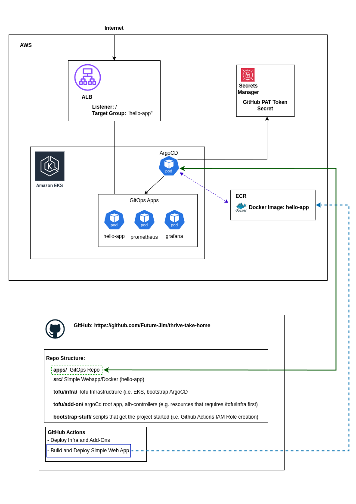

# thrive-take-home

# Table of Contents

- [thrive-take-home](#thrive-take-home)
- [Table of Contents](#table-of-contents)
  - [Prerequisites](#prerequisites)
  - [Overview](#overview)
  - [Getting started](#getting-started)
  - [Run bootstrap scripts](#run-bootstrap-scripts)
  - [Deploying Infrastructure and Add-Ons](#deploying-infrastructure-and-add-ons)
  - [Deploying Simple Web App (hello-app)](#deploying-simple-web-app-hello-app)
  - [To access ArgoCD UI](#to-access-argocd-ui)
  - [To access Grafana UI](#to-access-grafana-ui)
  - [Tradeoffs](#tradeoffs)
  - [Notes](#notes)
  - [TODO](#todo)

## Prerequisites
1. Access to an AWS Account and the corresponding <ACCOUNT_NUMBER>
2. Access to *this* repo 
3. A Github Personal Access Token (PAT) for *this* repo

## Overview

## Getting started
1. Clone Repo
  
## Run bootstrap scripts
1. Authenticate to AWS Account via CLI
2. Update <ACCOUNT_NUMBER> on line 7 of bootstrap-stuff/trust-policy.json
3. Run create-oidc-role.sh. 
4. Run enable-oidc.sh
5. Run create-gh-pat-secret.sh
    - __Prior__ to running this, obtain a GH PAT token for __this__ repo (see here: https://docs.github.com/en/authentication/keeping-your-account-and-data-secure/managing-your-personal-access-tokens)
    - This is necessary since our "gitops" repo is private and requires authentication. (ahem secrets manager ;-) )
6. Run create-s3-backend.sh and take note of the __s3 bucket__ in the output
7. Update the provider config in /tofu/infra/providers.tf for the terraform backend with the S3 bucket name (key is harcoded)
8. Update the provider config in /tofu/add-on/providers.tf for the terraform backend with the S3 bucket name (key is harcoded)
9. Update AWS Account ID tofu/infra/config/dev.tfvars variables
10. Update AWS Account ID tofu/add-on/config/dev.tfvars variables
11. Update account number in apps/hello-app/kustomization.yaml and in /apps/hello-app/deployment.yaml (not sure why kustomize isnt rendering correctly, need to fix)
12. In the GitHub UI, update the environment variable AWS_ACCOUNT_ID to your AWS account.  (Settings -> Secrets & Variables -> Actions -> Variables)
13. Should be good to push code to github now and run ci/cd jobs

## Deploying Infrastructure and Add-Ons
1. Push all files changed in the above steps
2. In the Github Actions UI, Manually trigger github action "Deploy Infra and Add-Ons". This might need to be run twice :( (TBD)
  - Upon successful completion, you should be able to login to argocd via the steps outlined below in "To access ArgoCD UI"

## Deploying Simple Web App (hello-app)
1. Run github action Build and Deploy Simple Web App (make a push in src/)
2. This action pushes a rendered argoCD/k8s manifest to the apps/hello-app/

## To access ArgoCD UI
0. Connect to EKS Cluster: 
   - aws eks update-kubeconfig   --region us-east-1   --name thrive-eks
1. Obtain default admin password argocd password(user is admin)
2. kubectl -n argocd get secret argocd-initial-admin-secret -o jsonpath="{.data.password}" | base64 -d
3. Port forward argocd service
   - kubectl port-forward service/argocd-server -n argocd 8080:443 
4. Visit localhost:8080.

## To access Grafana UI
0. Connect to EKS Cluster: 
   - aws eks update-kubeconfig   --region us-east-1   --name thrive-eks
1. Default user and password are both "admin"
2. Port forward grafana
    - kubectl port-forward -n monitoring svc/kube-prometheus-stack-grafana 3000:80
3. Visit localhost:3000
4. All baseline metrics from kube-prometheus-stack are being pushed to Grafana via prometheus (i.e. Node CPU, Memory, Reqs/Sec etc)

## Tradeoffs
- The role associated with OIDC and Github Actions is extremely permissive. This should be locked down and not wide open.
- Ingress is only working for the web app. We would need additional configurations to make other apps work with this ingress.
- ArgoCD and Grafana are not accessible via ingress. We could make them accessible over ingress too. 
- We could automate the manual update of hardcoded variables in the steps above (its error prone and annoying)
- The gh-pat secret was originally necessary because the repo was private. I made the repo public but kept part of the secret for the sake of demonstrating how to use secrets.
- Due a busy schedule, I didn't have time to prepare the alerts via email/slack
  

## Notes
- Deploy job needs to be run twice (need to fix this somehow)

## TODO
- argocd cant pull ecr image (why didnt kustomize render the acct number?)